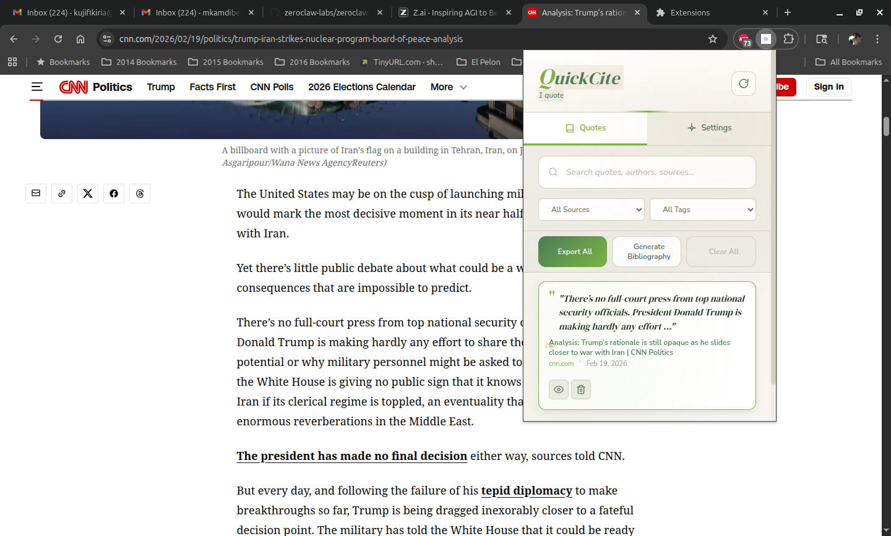
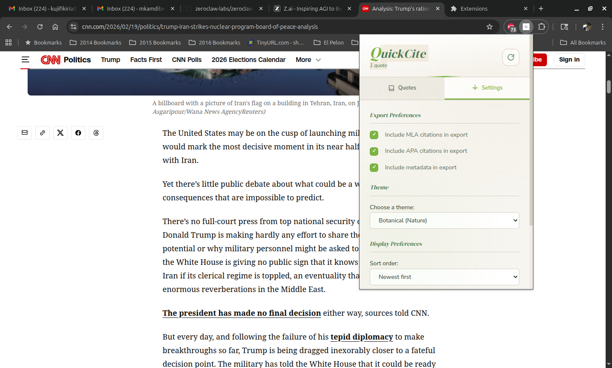

# QuickCite

**Stop wasting time formatting citations.**

QuickCite is a free, open-source Chrome extension that helps students, researchers, and writers save quotes from the web with perfectly formatted citations—instantly.

[](https://choosealicense.com/licenses/mit/)
[](https://chrome.google.com/webstore)
[](https://github.com/MuataSr/quickcite)

---

## ✨ Features

### Three Citation Styles, One Click
- **MLA 9th Edition** — Title case, proper punctuation
- **APA 7th Edition** — Sentence case, DOI support
- **Chicago Notes-Bibliography** — Academic standard

### Smart Metadata Extraction
- Automatically captures author, title, publication date, URL
- Recognizes academic papers, news articles, videos, blogs
- Special **arXiv integration** — pulls paper metadata automatically
- **YouTube/Vimeo** metadata extraction (channel, upload date)

### Source Intelligence
- Reliability classification (academic, government, news, etc.)
- Content warnings for questionable sources
- DOI and publisher detection

### Beautiful & Customizable
- **13 stunning themes** (Typewriter, Neon, Minimal, and more)
- Clean, distraction-free interface
- Dark mode options
- Search and organize with tags

### Export Anywhere
- One-click export to JSON
- Bibliography preview
- Copy individual citations or export all

### 100% Private
- All data stays on **YOUR device**
- No cloud, no account, no tracking
- No data leaves your browser
- Open source—verify it yourself

---

## 🚀 Installation

### From Chrome Web Store (Recommended)
*Coming soon!*

### From Source (Developer Mode)
1. Clone this repository
   ```bash
   git clone https://github.com/MuataSr/quickcite.git
   ```
2. Open Chrome and go to `chrome://extensions/`
3. Enable **Developer mode** (toggle in top right)
4. Click **Load unpacked**
5. Select the `quickcite` folder
6. Pin QuickCite to your toolbar for easy access

---

## 📖 How to Use

### Save a Quote (3 seconds)
1. **Select** any text on any webpage
2. **Right-click** → "Save Quote & Generate Citation"
3. **Done** — your quote is saved with a perfect citation

### View & Copy Citations
1. Click the **QuickCite icon** in your toolbar
2. Click the **eye icon** on any quote
3. View full details with MLA, APA, and Chicago citations
4. Click **Copy** to grab any citation format

### Organize with Tags
- Add tags to categorize quotes by topic, project, or source
- Filter quotes by tag for quick access
- Search across all your saved quotes

### Export Your Research
- Click **Export All** to download a JSON file
- Perfect for backup or importing into other tools
- Bibliography preview for easy reference

---

## 📸 Screenshots

| Empty State | Quote List | Citation Details |
|:-----------:|:----------:|:----------------:|
|  |  |  |

---

## 🎯 Perfect For

| User | Use Case |
|------|----------|
| 🎓 Students | Research papers, essays, theses |
| 🔬 Academics | Literature reviews, citations |
| 📰 Journalists | Source tracking, quote verification |
| ✍️ Content Creators | Reference gathering, attribution |
| 📚 Everyone | Saving interesting quotes from the web |

---

## 🌐 Works Everywhere

- **News sites** — BBC, CNN, Reuters, NYT, and more
- **Academic sources** — arXiv, Google Scholar, JSTOR, university sites
- **Video platforms** — YouTube, Vimeo, TED
- **Blogs & magazines** — Medium, Substack, WordPress
- **Government & institutional sites**
- **Any public webpage**

---

## 🔒 Privacy First

| ✅ What QuickCite Does | ❌ What QuickCite Doesn't Do |
|------------------------|------------------------------|
| Stores data locally on your device | Collect personal information |
| Work offline after installation | Send data to external servers |
| Open source for full transparency | Track your browsing |
| Respect your privacy completely | Require an account |

See [PRIVACY.md](PRIVACY.md) for full details.

---

## 📁 Project Structure

```
quickcite/
├── manifest.json       # Chrome extension manifest (MV3)
├── background.js       # Service worker for context menu
├── popup.html          # Extension popup UI
├── popup.js            # Popup functionality
├── styles.css          # Main stylesheet
├── themes/             # 13 theme variations
│   ├── typewriter.css  # Default theme
│   ├── neon.css        # Dark high-contrast
│   └── ...
├── icons/              # Extension icons
├── store/              # Chrome Web Store assets
│   └── screenshots/    # Store screenshots
├── docs/internal/      # Internal documentation
├── model/              # AI citation classification
├── LICENSE             # MIT License
├── PRIVACY.md          # Privacy policy
└── AGENTS.md           # Guidelines for AI contributors
```

---

## 🤝 Contributing

Contributions are welcome! Here's how to help:

1. **Report bugs** — Open an issue with details
2. **Suggest features** — Share your ideas in issues
3. **Submit pull requests** — Fix bugs or add features
4. **Improve documentation** — Help others understand the project

Please read the code style guidelines in [AGENTS.md](AGENTS.md).

---

## 📄 License

This project is licensed under the MIT License — see the [LICENSE](LICENSE) file for details.

**Free to use, modify, and distribute.**

---

## 🙏 Acknowledgments

- Citation formats follow [Purdue OWL](https://owl.purdue.edu/) standards
- Icons designed with clarity and accessibility in mind
- Built with modern Chrome Extension APIs (Manifest V3)

---

## 📬 Support

- **Bug reports:** [GitHub Issues](https://github.com/MuataSr/quickcite/issues)
- **Feature requests:** [GitHub Issues](https://github.com/MuataSr/quickcite/issues)
- **General questions:** Open a discussion on GitHub

---

<p align="center">
  <strong>Made with ❤️ for students, researchers, and writers everywhere.</strong>
</p>

<p align="center">
  <a href="https://github.com/MuataSr/quickcite">⭐ Star this repo</a> •
  <a href="https://github.com/MuataSr/quickcite/issues">Report a bug</a> •
  <a href="https://github.com/MuataSr/quickcite/blob/main/CONTRIBUTING.md">Contribute</a>
</p>
